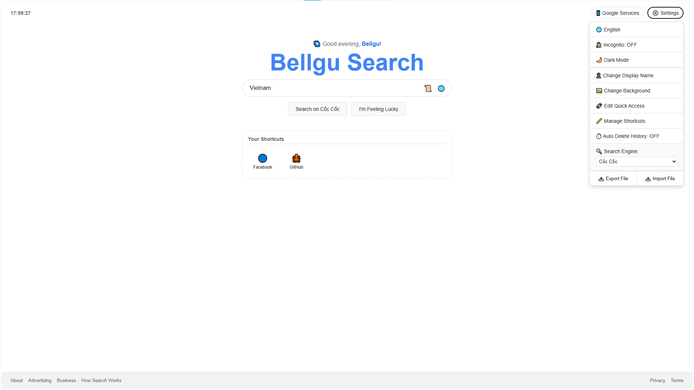

## Preview

# Bellgu-Search
Bellgu Search is an experimental web-based search launcher and personal dashboard built as a UI playground.

It combines a search engine wrapper, customizable shortcuts, quick access tools, and lightweight browser-like features into a single static HTML interface.

This project is designed as a concept showcase rather than a production product, focusing on user experience flow and interface ideas rather than backend complexity.

Features
Multi-search engine support (Google, Bing, DuckDuckGo, etc.)
Custom quick-access shortcuts
Search history with suggestions
Dark mode + incognito mode
Auto-clear history timer
Fully client-side (localStorage-based)
Config import/export system
Lightweight “mini dashboard” UI
Tech
HTML / CSS / Vanilla JavaScript
No backend required
Fully static, can be hosted on GitHub Pages
Note

This is an AI-assisted experimental project, created for idea exploration and UI testing purposes.
Not intended for commercial use.
